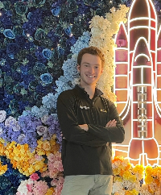

## Timeline

### 2023-present
### Wings Subsystem lead
### Distributed Electric Propulsion -- Senior Design Project
Our team of seven Mechanical & Aerospace Engineering seniors is designing, building, and flying a subscale Uncrewed Aerial Vehicle (UAV) using Distributed Electric Propulsion (DEP). I was elected to lead the development and manufacturing of the aircraft's wings, a process that has involved extensive computational modeling in Star CCM+ and XFLR5.

### 2023
### University of Florida
### Multiphase Reactive Flow Group
With Dr. Ryan Houim, I investigated the use of Symbolic Regression to discover a sparse relationship for speed of sound in a compressible polydisperse granular phase

### 2021-present
### Computational Biomechanics Lab
With Dr. Luigi Perotti, I am investigating the effect that a small boat's asymmetry has on it's total drag and planing characterisitcs. We are using a multiphase model with two allowed degrees of freedom to capture the translation and rotation from the hydrodynamic forces.

### 2021-2022
### Head of Aerodynamics
### Knights Racing Formula SAE Team
Elected by the team as Head of Aerodynamics in May of 2021 to lead the development, manufacturing, and testing of all aerodynamic components on UCF's student built race car. Testing involved extensive computational simulations using Star CCM+ and was roughly validated through tuft flow visualization.

### 2020-2021
### Computational Fluid & Aerodynamics Lab
With Dr. Michael Kinzel, I started using and understanding Computational Fluid Dynamics (CFD) software Star CCM+. Eventually began studying automotive aerodynamics and working with 4th year undergraduate student Andy Torres on data driven approaches to fluid dynamics.

