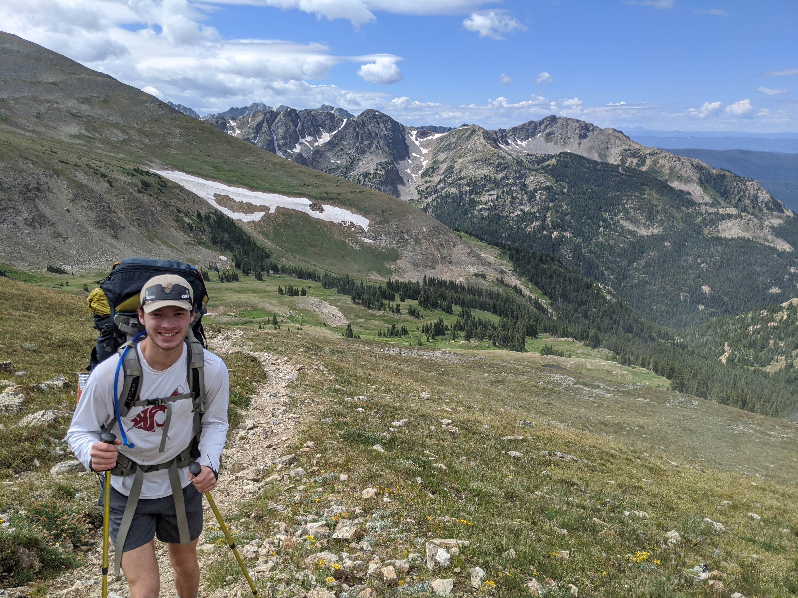

Hello! This is a work in progress, but you can find my CV [here](JGitzendanner_CV.PDF). I am a PhD student in the [Dufek Multiphase Flow Group](https://pages.uoregon.edu/jdufek/) at the University of Oregon studying particles in high-speed flows. Before this, I earned my Bachelor's degree in [Aerospace Engineering](https://mae.ucf.edu/) at the University of Central Florida.

I study the jet region of explosive volcanic eruptions, particularly as it relates to granular flows. My research is working to understand the sound speeds within the various materials being ejected, as well as the electromagnetic fields associated with the charged particles in this flow. To study this, I am using both numerical methods (a polydisperse, eulerian-eulerian 3D model) as well as various shock tube data.

Electromagnetic fields associated with high-speed granular flows are a topic of great interest to me and I look forward to continuing this research well into the future.

