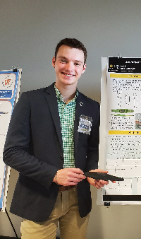

## Projects
### Kayak Polo
My primary project for the past two years has revolved around understanding the flow around small boats and vessels and using that to design a better polo kayak. Believe it or not, Kayak Polo is a real sport! It is also a fantastic case study for a much wider range of vessels due to the requirements it places on the equipment. We are currently studying how adjusting the asymmetry of a kayak in the streamwise direction changes it's planing characteristics.

### Compressible Polydisperse Granular Flows
This research was conducted over the summer of 2023 with UF's Multiphase Reactive Flow Group. The goal was to find an algebraic equation to approximate compression wave speed for each granular phase in a polydisperse eulerian-eulerian multiphase flow. I developed a shallow neural network to find a sparse function relating initial conditions to the wave speed.

